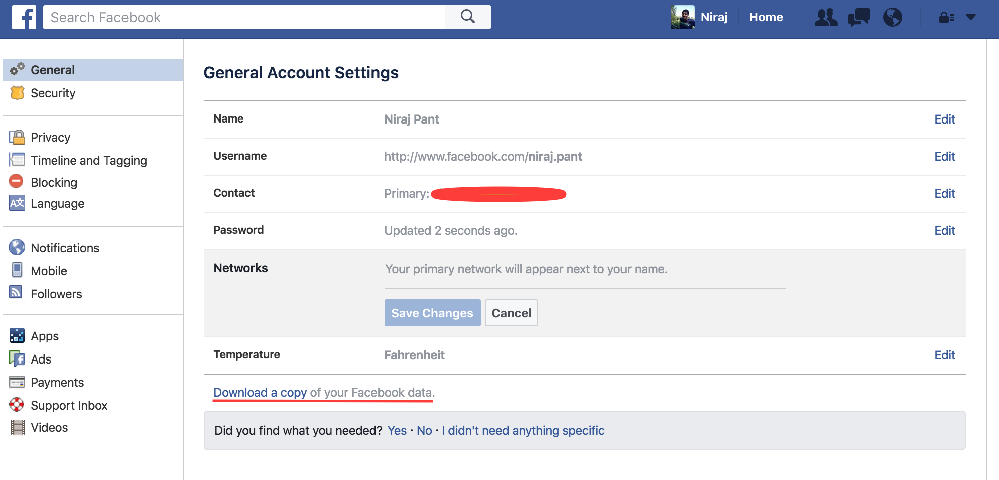

# messenger-stats
messenger-stats was inspired by [fb-chat-wordcloud](https://github.com/jpnelson/fb-chat-wordcloud), a Java library to generate wordclouds from FB Messenger messages. This library is extended a bit further to calculate:
 - # of threads
 - # of messages
 - Vulgarity index 
 - Most common time to send messages
 - Wordclouds for individual and group chats

## Setup
 - Navigate to [Download Your Information](https://www.facebook.com/dyi) on Facebook. Click on "Download a copy of your Facebook data."

 - After FB emails you a link to a zip file, unzip the archive, and copy `html/messages.htm` into the root directory of this cloned repo.
 - Then, run `python app.py` and voilà! A wordcloud and stats will be generated from your messages (the entire process may take a few minutes).

## Example Output

## License
messenger-wordcloud is licensed under the MIT License. See [`LICENSE`](LICENSE) for the full
license text.
